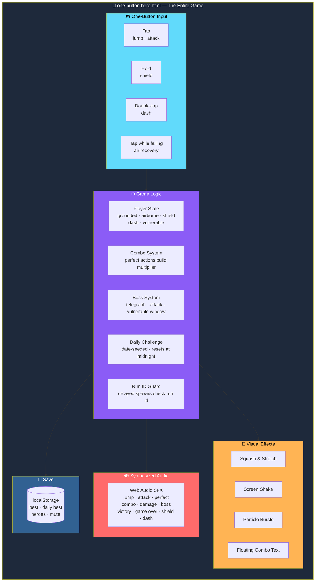
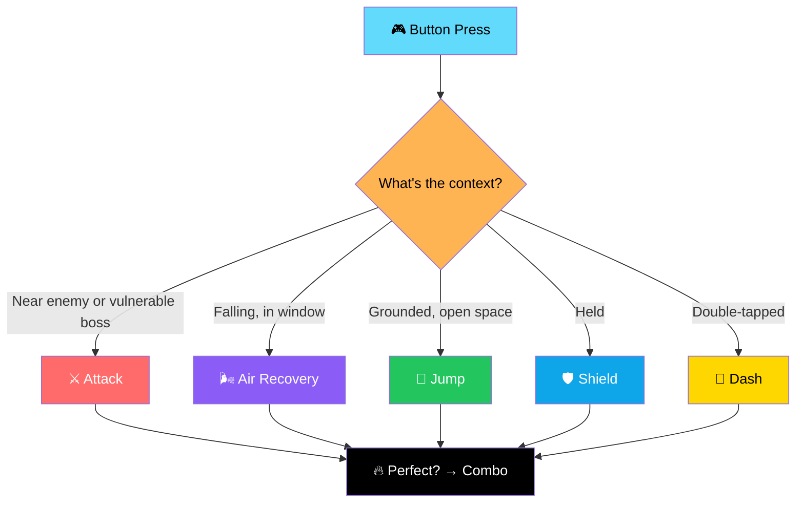
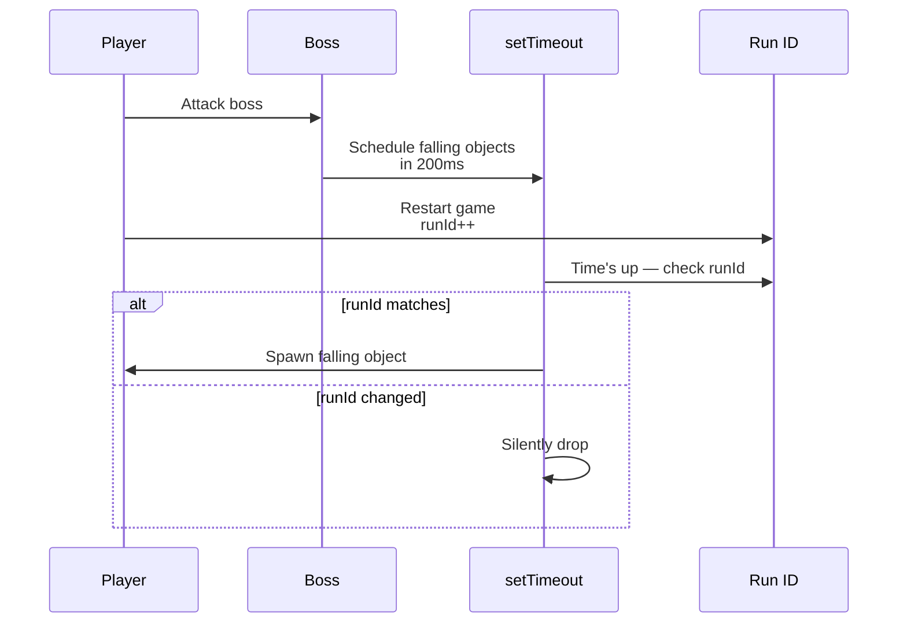

# 🎮 ONE BUTTON HERO

<div align="center">


**One button. Five meanings. Infinite chaos.**

*Tap, hold, or double-tap your way through spikes, gaps, enemies, projectiles, falling traps, and goofy bosses.*

[🎮 How to Run](#-how-to-run) • [🕹️ Controls](#-controls-one-button-five-meanings) • [🎯 Modes](#-modes) • [✨ Features](#-progression) • [🐛 Bugs Fixed](#-bugs-fixed-in-this-pass)

</div>

---

## 📖 Overview

**ONE BUTTON HERO** is a polished arcade game controlled entirely with **one button**.

Tap, hold, or double-tap your way through:

- ⚡ Spikes
- 🕳️ Gaps
- 👾 Enemies
- 🎯 Projectiles
- 💥 Falling traps
- 👹 Goofy bosses

### Core Idea

> **One input. Five meanings. Infinite skill ceiling.**
>
> The button does something different depending on context — and every one of those actions has a "Perfect" version worth more combo.

### 📁 Contents

```
one-button-hero.html   # the entire game — HTML, CSS, and JS in one file
README.md              # this file
```

> 💡 **No install, no dependencies, no external assets — just open it in a browser.**

---

## 🎮 How to Run

**Double-click `one-button-hero.html`** — or open it in any modern browser:

- Chrome · Safari · Firefox · Edge

> ✅ **Works on desktop and mobile.**

---

## 🕹️ Controls (One Button, Five Meanings)

| Input | Effect |
|-------|--------|
| **Tap** | **Jump** — or **Attack**, if an enemy / vulnerable boss is right in front of you |
| **Tap while falling** | **Air Recovery** — short window right after your jump arcs over |
| **Hold** | **Raise Shield** — release cleanly for a **"Perfect Shield"** |
| **Double-tap** | **Dash** — dodge projectiles / cross gaps / outrun spikes |
| **Timing near an obstacle** | **"Perfect"** version of the action — worth more combo / score |

### 🖥️ Desktop

**`Space`** or **mouse click**

### 📱 Mobile

**Tap / hold anywhere on the screen**

---

## 🎯 Modes

<div align="center">

| Mode | Description |
|:---:|-------------|
| **📖 Story** | Normal run — the first boss shows up early, and they keep coming as your score climbs |
| **♾️ Endless** | Same core loop, no end — just chase your best score |
| **👹 Boss Rush** | Back-to-back boss fights, **no filler obstacles** |
| **📅 Daily Challenge** | Same obstacle pattern for everyone on a given calendar day *(seeded from today's date)*, with its own separate best score. **Resets automatically at midnight** |

</div>

---

## ✨ Progression

<div align="center">

| 🦸 4 Unlockable Heroes | 🎨 Cosmetic Only |
|:---:|:---:|
| **Hero** · **Ninja** · **Wizard** · **Robot** — unlocked by beating score thresholds **0 / 150 / 400 / 800** | Each has its own color, which also tints your dash trail. **No character affects hitboxes, speed, or timing windows** |
| **💾 Persistent Save** | **🔥 Combo System** |
| Best score · daily best · unlocked heroes · selected hero · mute setting — all saved to `localStorage` | Perfect Jump / Attack / Dodge / Shield / Air Recovery all build a multiplier |

</div>

### 🔥 Combo System

**Perfect actions build a combo multiplier** shown on screen. The higher the combo, the more score each successful action is worth.

**Actions that build combo:**

- ✨ **Perfect Jump**
- ⚔️ **Perfect Attack**
- 🎯 **Perfect Dodge**
- 🛡️ **Perfect Shield**
- 🌬️ **Perfect Air Recovery**

> ⚠️ **Getting hit resets the combo to zero.**

### 👹 Bosses

**Three recurring mini-bosses**, each with its own attack pattern:

| Boss | Attack Pattern |
|------|---------------|
| **Sir Flopsalot** | Ground smash |
| **Grumpy Cloud** | Falling-object rain |
| **Doom Duck** | Charging projectile |

**Every boss has:**

- ⚠️ A **telegraph warning** before every attack
- ❤️ A **health bar**
- 🎯 A brief **"HIT ME!"** vulnerable window after each attack — where your attacks actually land

> 💡 **Difficulty (obstacle speed and spawn rate) increases the longer you survive.**

### 🔊 Audio & Visuals

**All sound effects are synthesized on the fly with the Web Audio API:**

- Jump
- Attack
- Perfect
- Combo
- Damage
- Boss
- Victory
- Game over
- Shield
- Dash

> 💡 **Nothing to load, nothing to break. There's a mute button (top-left) if you'd rather play in silence.**

**Visuals:**

- **Colorful cartoon-arcade look**
- **Squash-and-stretch** on attacks
- **Screen shake** on hits
- **Particle bursts**
- **Floating combo text**

---

## 🐛 Bugs Fixed in This Pass

> **This build replaces an earlier draft that had several real, playable-experience-breaking bugs.**
>
> In case it's useful context, here's what was actually wrong and what changed.

<div align="center">

| # | Bug | Fix |
|:-:|-----|-----|
| **1** | **Boss fights were unbeatable** — the boss stood far off-screen from the player's fixed position, so the "is the player close enough to hit the boss" check never passed and attacks always whiffed | The boss now **spawns at melee range** so vulnerable windows are actually reachable |
| **2** | **Air Recovery never expired** — a timing window meant to last ~0.35s after a jump was accidentally being **reset to full every single frame**, making the "must time it right" mechanic trivial | It now **opens once per fall and depletes properly** — a real skill window again |
| **3** | **Jumping over spikes/enemies was needlessly strict** — the old height check required you to be near the very peak of your jump to count as "cleared" | Clearing now **just requires being airborne**, with a tighter proximity window rewarding a well-timed **"Perfect Jump"** on top |
| **4** | **Gaps did nothing** — they scrolled past with **no collision or scoring logic at all** | Gaps now **genuinely require a jump or dash to cross** — walk into one and it's game over, like every other obstacle |
| **5** | **Menu buttons could be blocked by the invisible tap layer** — the full-screen input zone was stacked **above** the menu / pause / game-over screens | **Z-index ordering is fixed** so overlays and their buttons always receive input |
| **6** | **Distorted / stretched canvas on some phone screen ratios** | The game area now keeps a **fixed 3:2 aspect ratio** using `aspect-ratio` + `dvh`-aware sizing — always fits without squashing or stretching, portrait or landscape |
| **7** | **Double game-over triggers** — multiple obstacles overlapping in the same frame could each independently end the run, double-counting the "new best score" save | `hitPlayer` now **guards against firing more than once per run** |
| **8** | **Stale timers leaking into new runs** — some boss attacks schedule follow-up obstacles with `setTimeout`, and restarting mid-attack could land them in your new run | Each run now has an **id**, and **delayed spawns check it** before doing anything |
| **9** | **Daily Challenge wasn't actually daily** — it used the same random obstacle pattern as Endless, so it wasn't a fair "same challenge for everyone" mode | It's now **seeded from the real calendar date** *(deterministic per day)* with its own tracked best score that **resets when the date rolls over** |
| **10** | **No mute option** | Added a **persistent mute toggle** *(top-left speaker icon)* — a purely synthesized-audio game should let you turn it off |

</div>

---

## ⚠️ Known Limitations

> **Kept simple on purpose.**

<div align="center">

| Limitation | Details |
|-----------|---------|
| **No weapons, no unlockable trails beyond color tinting** | Only **heroes / costumes** are implemented — all cosmetic, none affect gameplay |
| **Boss defeats share one animation** | One particle-burst animation, not a unique animation per boss |
| **No scripted "ending"** | Story and Boss Rush **both scale difficulty forever** rather than stopping after a fixed number of stages — in keeping with a score-chasing arcade design |

</div>

---

## 🏗️ Architecture

### Everything in One File



### One Button, Five Meanings — Context Resolution



### The Run ID Guard — Fixing Stale Timers



> 💡 **This is the fix for Bug #8** — stale timers from a previous run can no longer land in your new one.

### Design Principles

<div align="center">

| Principle | Implementation |
|-----------|---------------|
| **📄 One file, zero dependencies** | The whole game is one HTML file — no build step, works offline |
| **🎮 One button, five meanings** | Context decides: jump, attack, shield, dash, or air recovery |
| **✨ Every action has a "Perfect" version** | Timing near an obstacle upgrades any action and builds combo |
| **🐛 Bugs are documented, not hidden** | Ten real bugs from an earlier draft are listed with their fixes |
| **🎨 Visual feedback for every action** | Squash-and-stretch, screen shake, particle bursts, floating text |
| **🔊 Audio with no assets** | Every sound synthesized live — nothing to load, nothing to break |
| **💾 Progress without a backend** | `localStorage` — best score, daily best, heroes, mute |
| **📅 Daily means daily** | Date-seeded deterministic pattern with its own best score that resets at midnight |
| **🛡️ Run ID guards against stale timers** | Delayed spawns check the run they belong to |
| **♾️ Arcade-forever by design** | No scripted ending — score-chasing is the point |

</div>

---

## 🗺️ Roadmap

### ✅ Current

- [x] One-button control with five context-dependent actions
- [x] Perfect versions of every action, feeding a combo multiplier
- [x] Four modes — Story, Endless, Boss Rush, Daily Challenge
- [x] Daily Challenge seeded from real calendar date
- [x] Daily best score that resets when the date rolls over
- [x] Four unlockable heroes with distinct color tinting
- [x] Cosmetic-only progression — no gameplay impact
- [x] Three recurring bosses with telegraphed attacks
- [x] Vulnerable windows after each boss attack
- [x] Difficulty scaling over time
- [x] Fully synthesized Web Audio sound effects
- [x] Persistent mute toggle
- [x] Squash-and-stretch, screen shake, particle bursts, floating combo text
- [x] Fixed 3:2 aspect ratio, `dvh`-aware sizing
- [x] `localStorage` persistence for all progress
- [x] Single-file, zero-dependency, works offline
- [x] **Ten real bugs fixed** — bosses, air recovery, spike clearing, gaps, z-index, canvas distortion, double game-over, stale timers, daily challenge, mute

### 🔜 Future Ideas

- [ ] **Weapons** — unlockable and gameplay-affecting
- [ ] **Unlockable trails** — beyond per-character color tinting
- [ ] **Unique boss defeat animations** — one per boss
- [ ] **Scripted ending** — a fixed finale for Story mode
- [ ] **Additional heroes** with unique visual flair
- [ ] **Leaderboards** — local and online
- [ ] **Achievements**
- [ ] **Photo mode** for shareable highlights
- [ ] **Gamepad support** — the button is universal
- [ ] **Replay system**

---

## 🤝 Contributing

Contributions are welcome. Please:

1. Fork the repository
2. **Keep it single-file** — no external build step, no bundler
3. **Keep it asset-free** — no image files, no audio files
4. **Preserve the one-button constraint** — every new mechanic fits the same input
5. **Guard against stale timers** — the run ID pattern is the standard
6. **Document bugs you fix** — the **Bugs Fixed** section is the template
7. Test on both desktop and mobile
8. Submit a Pull Request

### Guidelines

- **Never add a required external dependency** — the game must run from `file://`
- **Never require a build step** — `one-button-hero.html` and nothing else
- **Never let a menu button be blocked** by the invisible input layer
- **Never break the aspect ratio** on any device
- **Never let a stale timer land in a new run**
- **Never present a stub as a feature** — the **Known Limitations** section is the standard

---

## 📜 License

MIT — see [LICENSE](LICENSE) for details.

---

## 🙏 Acknowledgments

- **Web Audio API** — for a game with zero audio files
- **Every game that ever proved one button is enough** — this one's for you
- **Every player who's ever raged at an unfair hitbox** — this build is for you

---

<div align="center">

### 🎮 TAP. HOLD. DOUBLE-TAP. PERFECT.

**One button. Five meanings. Infinite chaos.**

**Ten real bugs fixed. Zero fake buttons.**

<br>

⭐ If you enjoyed this game, consider giving it a star.

<br>

[⬆ Back to Top](#-one-button-hero)

</div>
